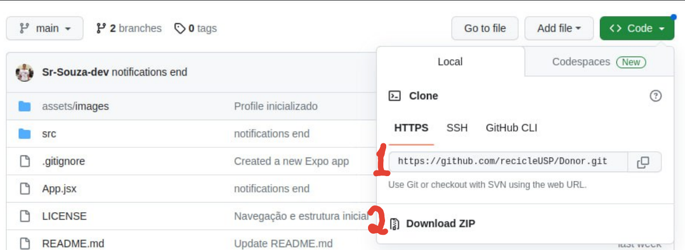
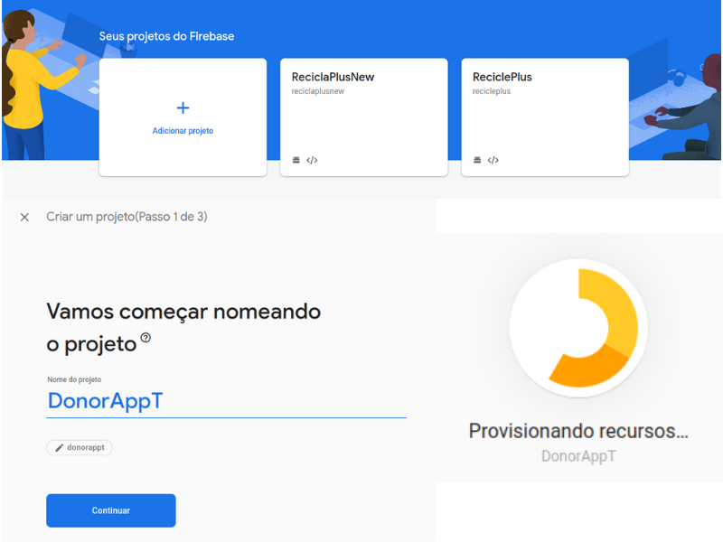

# Donor (Aplicato do doador)

Uma parceria entre USP/CEFET-MG, para criar o software de doação de lixo reciclável as organizações. 

## Primeioros passos


Para configurar o ambiente, é necessário fazer o download do projeto. Você pode optar por baixar o zip do projeto de forma direta, como mostrado na marcação 2 da imagem acima, ou clonar o repositório utilizando o seguinte comando, com a URL destacada na marcação 1 da imagem acima:

```sh
git clone https://github.com/recicleUSP/Donor.git
```

## Executando o projeto
Para executar o projeto, é importante garantir que todos os pacotes necessários estejam disponíveis em sua máquina. A seguir, apresentamos um passo a passo para configurar o ambiente e executar o projeto, dividido em duas seções: uma para aqueles que não possuem o React Native instalado e outra para aqueles que já têm o ambiente configurado. É importante ressaltar que, caso você ainda não tenha o React Native instalado, será necessário concluir ambas as etapas a seguir (Tal processo deve ser realizado no sistema operacional Linux): 

#### Não tenho o React Native (Expo) instalado
O processo de instalação do React Native no Linux envolve alguns passos. Aqui está um guia básico para ajudar você a configurar o ambiente de desenvolvimento (no terminal, digite os seguintes comandos):

1. Instale o Node.js
   ```sh
    sudo apt-get update
    sudo apt-get install -y nodejs
   ```
   Verifique se a instalação foi concluída com sucesso executando node -v e npm -v no terminal.

2. Instale o JDK (Java Development Kit)
   ```sh
    sudo apt-get install -y openjdk-8-jdk
   ```
   Verifique se a instalação foi concluída com sucesso executando java -version no terminal.

3. Instale o React Native CLI e outras dependências
   ```sh
    sudo npm install -g react-native-cli
   ```

4. Instale o Expo CLI globalmente
   ```sh
    sudo npm install -g expo-cli
   ```
   
5. Instale o Yarn (opcional, mas recomendado) com o seguinte comando
    ```sh
    sudo npm install -g yarn
   ```

#### Já tenho o React Native instaldo
Com o projeto baixado, você deve entrar na pasta raiz do projeto e abrir um terminal para instalar os pacotes necessários, permitindo realizar a execução do mesmo. Para isso, execute o seguinte comando:
6. Instalando dependências do projeto
    ```sh
    npm install 
    ```
7. Executando o projeto pelo pacote npm
     ```sh
    npm start 
    ```
8. Executando o projeto pelo pacote expo
     ```sh
    npx expo start 
    ```

## Adicionado seu Próprio Banco de Dados Firebase
Para começar a utilizar o projeto de maneira personalizada e individual, é necessário criar um banco de dados Firebase e conectá-lo ao aplicativo específico. É importante ressaltar que os dados inseridos no aplicativo são apenas exemplos e nenhuma operação real está sendo realizada no banco de dados.
1. Crie uma conta ou faça login no Firebase 
    *  Acesse o site do Firebase (https://firebase.google.com) e faça login ou crie uma nova conta.
    *  
2. Crie um novo projeto no Firebase
    * No console do Firebase, crie um novo projeto clicando no botão "Adicionar projeto" e siga as instruções fornecidas.
    

3. Gere uma aplicação Web dentro do fire base
    * O processo de geração de uma nova aplicação pode ser visualizado através do gif abaixo
    

4. Adicionando informações retornadas pelo firebase no projeto React-native
   1. Copie os dados selecionados no gif anterior
   2. Abra o arquivo src/constants/firebase.ts e substitua o 'firebaseConfig pelo que foi copiado anteriormente
   
5. Crie os bancos de dados utilizados. Na aba de criação que pode ser visualizada na imagem abaixo, gere:
   1. firestore Database
   2. Authentication
   3. storage
   
6. Feito isso, o projeto já pode ser executado normalmente e todas informações serão enviadas diretamente para esse banco de dados criado.


## Configuração de Layout


# Autores

 - Gabriel Rosa
 - Leonrado Capos
